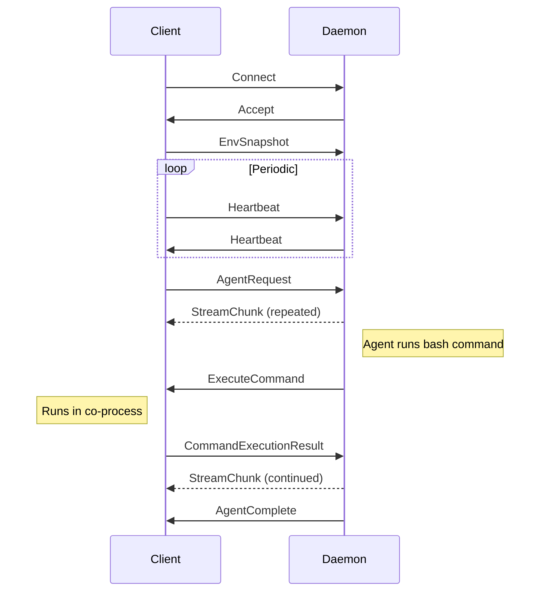

## Client (codiv)

The client is a terminal application built with [ratatui](https://ratatui.rs/). It handles:

### Terminal Rendering

- Full TUI with scrollable output panes
- Markdown rendering via streamdown-rs with syntax highlighting
- Terminal colorscheme detection for proper theming

### Bash Co-Process

A persistent bash child process runs alongside the TUI. When you type a known command, it is sent directly to this co-process for instant execution — no daemon round-trip needed.

The co-process also handles AI-relayed commands via the command relay protocol. When the orchestrator agent runs a bash command, the daemon sends an `ExecuteCommand` message to the client, which executes it through this same co-process and returns a `CommandExecutionResult` with the output, exit code, and updated working directory. This means the AI agent shares shell state (environment variables, working directory, etc.) with the user.

### Command Index

At startup, the client builds a hash map of all known commands:

- Executables from every directory on `PATH`
- Bash and zsh builtins

This allows O(1) lookup to classify input as a known command or an AI query.

### Tab Completion

Three tiers of tab completion:

1. **Programmable** — bash-completion scripts for commands that support them
2. **Command** — completes command names from the index
3. **File** — filesystem path completion

## Daemon (codivd)

The daemon is a Tokio async application that handles all AI and tool operations:

### Agent Sessions

Each AI query creates a session with context from the terminal timeline. The agent reasons, calls tools, and streams results back to the client.

### LLM Streaming

Responses stream token-by-token from the LLM provider via the aisdk library. Supports Anthropic, OpenAI, and Google providers with a unified interface.

### Worker Bash Sessions

The orchestrator agent does not use a separate worker session — its bash commands route through the client's co-process via the command relay (see above), so shell state is shared with the user. Independent agents (engineer, reviewer, etc. in multi-agent mode) get their own daemon-side `DaemonShell` instances — pipe-based `bash -i` processes with fresh state, inheriting only the initial working directory from the parent.

## IPC Communication

The client and daemon communicate over a Unix domain socket using:

- **Serialization** — serde + bincode (compact binary format)
- **Framing** — 4-byte big-endian length prefix followed by the payload
- **Lifecycle** — the client connects at startup, maintains a heartbeat, and reconnects if the connection drops

### Connection Lifecycle

The heartbeat ensures both sides detect connection loss promptly. If the daemon restarts, the client reconnects and re-sends the environment snapshot.
