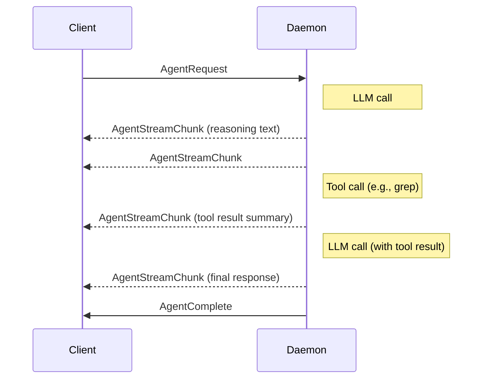
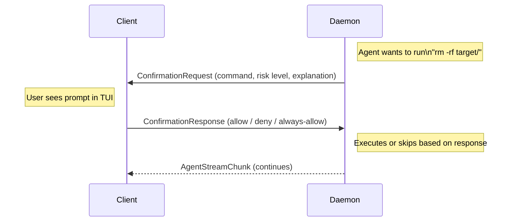
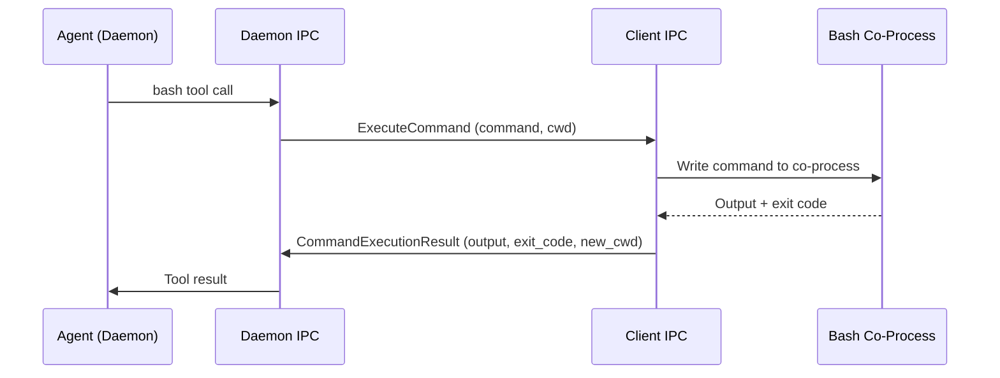

## Wire Format

All IPC messages use a simple length-prefixed binary format:

```
┌──────────────┬──────────────────────────┐
│ 4 bytes (BE) │ bincode payload          │
│ length       │ (serde-serialized)       │
└──────────────┴──────────────────────────┘
```

- **Length** — 4-byte big-endian unsigned integer indicating the payload size in bytes
- **Payload** — bincode-serialized Rust struct

This keeps parsing simple and avoids delimiter-based framing issues with binary data.

## Message Types

| Message | Direction | Purpose |
|---------|-----------|---------|
| `EnvSnapshot` | Client to Daemon | Sends current environment variables, working directory, terminal size |
| `Heartbeat` | Bidirectional | Keep-alive ping/pong |
| `AgentRequest` | Client to Daemon | User query with session context |
| `AgentStreamChunk` | Daemon to Client | Streaming token from LLM response |
| `AgentComplete` | Daemon to Client | Agent finished processing |
| `ConfirmationRequest` | Daemon to Client | Ask user to approve a risky command |
| `ConfirmationResponse` | Client to Daemon | User's approval or denial |
| `CommandResult` | Daemon to Client | Result of a tool execution |
| `ExecuteCommand` | Daemon to Client | Route AI bash command through client's co-process |
| `CommandExecutionResult` | Client to Daemon | Relay result with output, exit code, and updated cwd |

## Agent Task Flow

A typical AI query follows this sequence:



## Safety Confirmation Flow

When the agent wants to run a command classified as risky:



## Command Relay Flow

When the orchestrator agent runs a bash command, it is relayed through the client's co-process so that shell state is shared with the user:



Independent agents (engineer, reviewer) bypass this relay and execute commands in their own daemon-side `DaemonShell` processes.

## Versioning

The IPC protocol is versioned implicitly through the shared `codiv-common` crate. Since both client and daemon are built from the same workspace, they always use matching message definitions. The `EnvSnapshot` message includes a protocol version field for future compatibility when independent versioning is needed.
