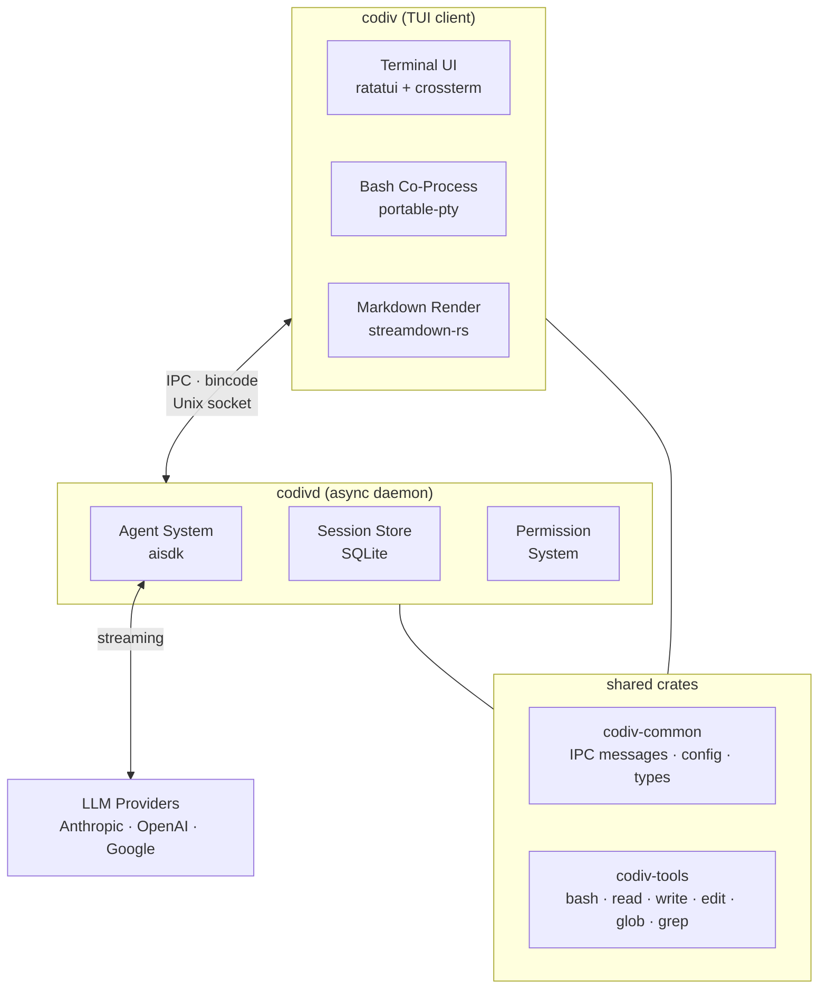

## System Overview

Codiv is split into two processes that communicate over a Unix domain socket:

- **codiv** — the TUI client that renders your terminal interface
- **codivd** — the async daemon that runs AI agents and executes tools

This split keeps the terminal responsive. The client handles rendering and input at native speed while the daemon manages long-running AI operations in the background.

## Architecture Diagram

## Crate Structure

The workspace contains four crates:

| Crate | Purpose |
|-------|---------|
| `codiv` | TUI client — terminal rendering, bash co-process, dual-mode input, tab completion |
| `codivd` | Async daemon — AI agent, session management, LLM streaming, tool execution |
| `codiv-tools` | Shared library — tool implementations (bash, read, write, edit, glob, grep) and agent guides |
| `codiv-common` | Shared types — IPC messages, config, utilities |

## Key Design Decisions

### Why Client/Daemon Split?

The terminal needs to be responsive at all times — you should be able to type, scroll, and run commands even while the AI is working. By running the AI agent in a separate daemon process, we guarantee the TUI never blocks on LLM calls.

### Why Rust?

- **Performance** — direct shell execution with sub-10ms latency requires no GC pauses
- **Safety** — memory safety without runtime overhead, critical for a tool that executes commands
- **Async** — Tokio provides excellent async I/O for streaming LLM responses and concurrent tool execution
- **Single binary** — no runtime dependencies to install

### Why Unix Socket IPC?

Unix domain sockets provide low-latency, reliable local communication with built-in flow control. Combined with serde + bincode serialization and length-prefixed framing, this gives us a simple, fast binary protocol.
