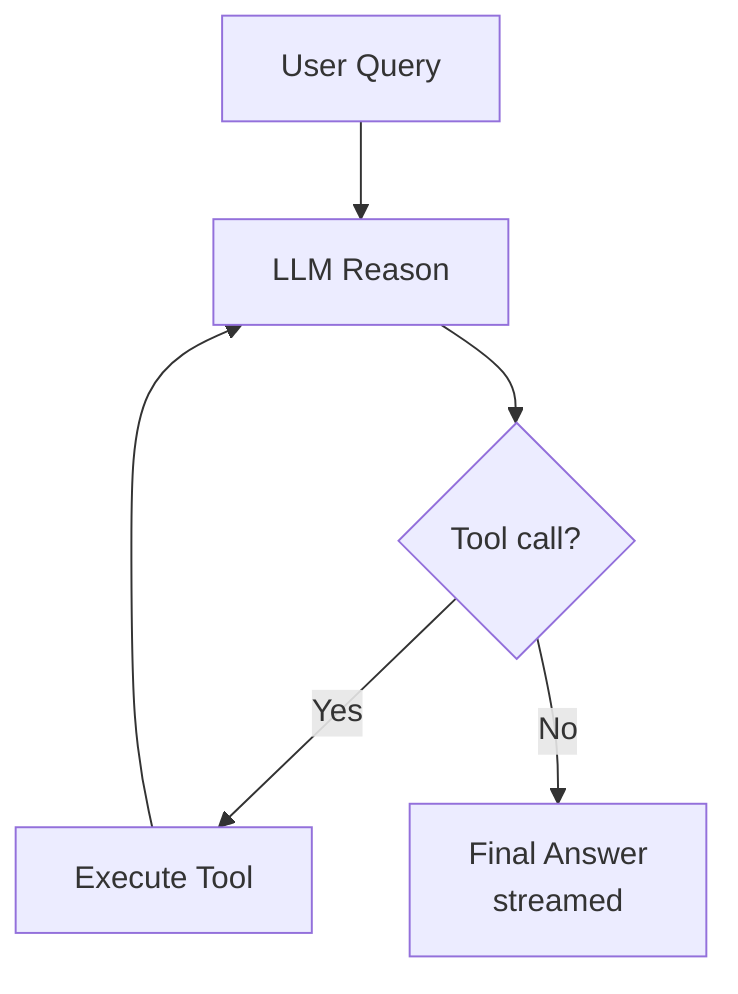

## Overview

The Codiv agent is the core AI component that processes natural language queries and performs multi-step tasks using tools. It runs in the daemon process and communicates with the client via IPC streaming.

## Architecture Evolution

The agent system evolves across project phases:

- **Phase 2 (current)** — A single combined agent handles all queries. It receives the full session context, reasons about the task, and calls tools in a loop until done.
- **Phase 4 (planned)** — Multiple specialized agent roles (Orchestrator, TeamLead, Engineer, Reviewer, Narrator) with different models assigned per role. Frontier models handle planning; cheaper models handle routine tasks like memory curation.

## Tool Calling Loop

The agent operates in a reason-act cycle:

Each tool call result feeds back into the LLM context for the next reasoning step. The agent can chain many tools — for example, grep to find files, read to examine them, edit to make changes, then bash to run tests.

## System Prompt Structure

The system prompt provides the agent with:

- **Identity and capabilities** — what tools are available and how to use them
- **Session context** — recent shell commands, their output, and previous AI interactions
- **Safety rules** — which operations require confirmation
- **Environment** — working directory, OS, shell, and project context

## Context Management

LLM context windows have finite capacity. Codiv manages this with:

- **Token budgeting** — the session timeline is trimmed to fit within the model's context window
- **Compaction** — older entries are summarized to preserve key information while reducing token count
- **Priority** — recent commands and the current query take priority over older history

## Streaming Output

Agent responses stream to the terminal token-by-token:

1. Daemon receives tokens from the LLM provider
2. Each token is wrapped in an `AgentStreamChunk` IPC message
3. Client receives chunks and renders them as markdown in real time
4. Syntax highlighting and formatting update progressively

## Shared Shell State

The orchestrator agent shares the user's shell environment through a command relay protocol:

- When the orchestrator runs a bash command, it is routed through the client's PTY co-process via `ExecuteCommand` / `CommandExecutionResult` IPC messages. Commands like `cd /tmp` or `export FOO=bar` immediately take effect in the user's terminal, and vice versa.
- Independent agents (engineer, reviewer, etc. in multi-agent mode) get isolated `DaemonShell` instances — pipe-based `bash -i` processes on the daemon side with fresh state and the initial working directory inherited from the parent.
- The shared working directory is tracked via `Arc<RwLock<String>>` so both the agent and IPC layer stay in sync.

This design means the AI operates in the same shell context as the user, making tool execution feel seamless.

## Error Handling and Stop Conditions

The agent loop terminates when:

- The LLM produces a final response without tool calls
- A maximum iteration count is reached (prevents infinite loops)
- The user cancels the operation
- An unrecoverable error occurs (API failure, timeout)

Tool execution errors do not stop the loop — the error message is fed back to the LLM so it can adapt its approach.
