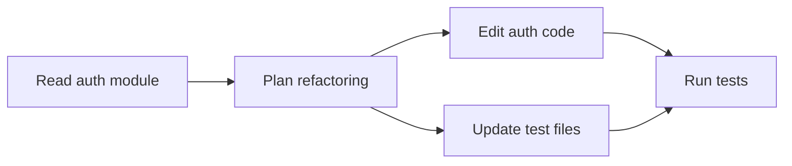

## Overview

For complex tasks that involve multiple steps, Codiv decomposes the work into a directed acyclic graph (DAG) of **Work Items**. This enables concurrent execution — independent steps run in parallel while respecting dependencies.

## Work Item Data Model

Each Work Item tracks:

| Field | Description |
|-------|-------------|
| `id` | Unique identifier |
| `title` | Human-readable description of the task |
| `status` | Current state (see state machine below) |
| `dependencies` | List of Work Item IDs that must complete first |
| `artifacts` | Output files or data produced |
| `token_budget` | Maximum tokens this item may consume |
| `cost` | Actual token/cost usage |

## State Machine

Work Items follow a deterministic state machine:

```mermaid
stateDiagram-v2
    [*] --> Pending
    Pending --> Running : dependencies met
    Running --> Completed
    Running --> Failed
    note right of Pending : Additional states:\nBlocked, Cancelled
```

## DAG Construction

When the agent receives a complex task, it:

1. **Plans** — breaks the task into discrete work items
2. **Identifies dependencies** — determines which items depend on others
3. **Builds the DAG** — constructs the graph with edges representing "must complete before"
4. **Validates** — checks for cycles (which would be invalid)

For example, "refactor the auth module and update all tests" might produce:



## Concurrent Execution

The scheduler uses Tokio to run independent Work Items in parallel:

- Items with no pending dependencies start immediately
- As items complete, newly unblocked items begin
- The DAG structure guarantees correct ordering without manual coordination

## Budget Enforcement

Each Work Item has a token budget. The scheduler:

- Tracks token usage per item
- Pauses items approaching their budget limit
- Reports cost breakdowns per item and for the overall task

## Artifact Storage

Work Items can produce artifacts — files created, test results, analysis outputs. These are stored alongside the Work Item and available to downstream items that depend on them.
